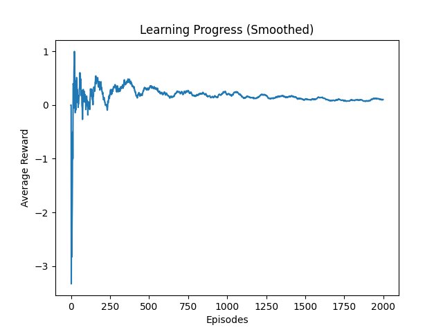

# 💔 Emotion-Aware Conflict Resolution using Reinforcement Learning

💡 Inspired by real-life human emotional decision-making rather than traditional game-based RL environments.

---

## 📌 Problem
Human conflicts often escalate due to poor emotional decisions and wrong timing. Handling emotions correctly is a key challenge in real-life interactions.

---

## 💡 Solution
This project simulates relationship conflict scenarios where a Reinforcement Learning (RL) agent learns to take better decisions based on:
- Mood (angry, sad, normal)
- Severity of the issue
- Time gap between interactions

The agent chooses actions like apologizing, explaining, ignoring, or giving space.

---

## ⚙️ Features
- Emotion-aware decision making  
- Severity-based reward system  
- Timing-based optimization  
- Simple RL-based learning model  

---

## 🎯 Actions
- Ignore  
- Apologize  
- Explain  
- Give Space  

---

## 🏆 Reward Strategy
- Positive reward for emotionally appropriate actions  
- Negative reward for wrong decisions  
- Extra reward for correct timing  
- Penalty for escalation-causing behavior  

---

## 🧪 Example Scenario

- Mood: Angry  
- Severity: High  
- Time Gap: Long  

👉 Agent Decision: Give Space  

This demonstrates how the model learns emotionally intelligent responses.

---

## 📈 Learning Graph

---

## 🚀 Result
The agent improves its decision-making over time. This is shown using a reward progression graph, proving that the model is learning optimal behavior.

---

## 🔮 Future Scope
- Multi-step conversation modeling  
- Integration with chatbot systems  
- Emotion detection using NLP  
- Real-world relationship assistant applications  

---

## 🧠 Tech Stack
- Python  
- NumPy  
- OpenAI Gym  
- Matplotlib  

---

## 📂 Project Structure
couple-conflict-rl/
│── env.py
│── train.py
│── plot.py
│── gra
---

## 🎤 Author Note
This project focuses on applying AI to human emotional intelligence rather than traditional technical problems, making it more relatable and impactful.ph.png
│── README.md
